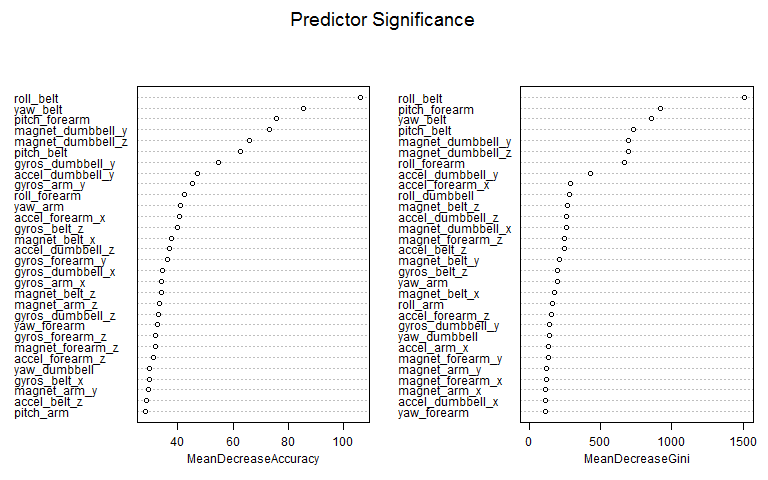
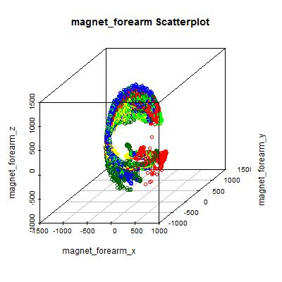

# Prediction Assignment Writeup


###Synopsis
Devices such as Jawbone Up, Nike FuelBand, and Fitbit collect a large amount of data about personal activity.
Six participants were asked to perform barbell lifts correctly and incorrectly in 5 different ways and
data was collected from accelerometers on the belt, forearm, arm, and dumbell.
The goal of this study is to predict the manner in which they did the exercise.

  
###Data
The [TRAINING](https://d396qusza40orc.cloudfront.net/predmachlearn/pml-training.csv) and [TESTING](https://d396qusza40orc.cloudfront.net/predmachlearn/pml-testing.csv) are both available, as well as additional information at [GroupWare](http://groupware.les.inf.puc-rio.br/har), including a [Data Description](http://groupware.les.inf.puc-rio.br/public/papers/2013.Velloso.QAR-WLE.pdf) document.


###Requirements
Reproducing this analysis requires use of the following R packages


```r
library(dplyr);
library(ggplot2);
library(knitr);
library(caret);
library(corrplot);
library(grid);
library(FSelector);
library(rgl);
library(doParallel);
library(scatterplot3d);
library(randomForest);
```


###Perform exploratory analysis on the raw data.

Summaries of the training and testing data reveals several issues. Most notably, both training and testing are very sparse:  
Training data contains 41.01% NA values, 0.2% empty strings, and 3502 instances of the string "#DIV/0!".  
Testing data contains 0.62% NA values, 0% empty strings, and 0 instances of the string "#DIV/0!".  

The data also contains several malformed variable names.

Thankfully the [Data Description](http://groupware.les.inf.puc-rio.br/public/papers/2013.Velloso.QAR-WLE.pdf) document describes the  composite variables embedded with the raw data.  Removing these variables conveniently solves all the data the issues outlined above.


```r
#RTFM shows the data contains composite variables:
# mean
# variance
# standard deviation
# max
# min
# amplitude
# kurtosis
# skewness

#remove composite variables
training <- training[,!grepl("^min_", colnames(training))];
training <- training[,!grepl("^max_", colnames(training))];
training <- training[,!grepl("^stddev_", colnames(training))];
training <- training[,!grepl("^total_", colnames(training))];
training <- training[,!grepl("^avg_", colnames(training))];
training <- training[,!grepl("^amplitude_", colnames(training))];
training <- training[,!grepl("^kurtosis_", colnames(training))];
training <- training[,!grepl("^skewness_", colnames(training))];
training <- training[,!grepl("^var_", colnames(training))];

testing <- testing[,!grepl("^min_", colnames(testing))];
testing <- testing[,!grepl("^max_", colnames(testing))];
testing <- testing[,!grepl("^stddev_", colnames(testing))];
testing <- testing[,!grepl("^total_", colnames(testing))];
testing <- testing[,!grepl("^avg_", colnames(testing))];
testing <- testing[,!grepl("^amplitude_", colnames(testing))];
testing <- testing[,!grepl("^kurtosis_", colnames(testing))];
testing <- testing[,!grepl("^skewness_", colnames(testing))];
testing <- testing[,!grepl("^var_", colnames(testing))];


#removing composite variables took care of the NA propensity
sum(is.na(training)) / (dim(training)[1] * dim(training)[2]);
sum(is.na(testing)) / (dim(testing)[1] * dim(testing)[2]);

#removing composite variables took care of the blanks
sum(apply(training, 2, function(x) sum(as.character(x) == "")))
sum(apply(testing, 2, function(x) sum(as.character(x) == "")))

#removing composite variables took care of the MS Excel error:  #DIV/0!
sum(apply(training, 2, function(x) sum(as.character(x) == "#DIV/0!")))
sum(apply(testing, 2, function(x) sum(as.character(x) == "#DIV/0!")))

#removing composite variables took care of the misspelled variable names as well...very convenient


#no use for the first 7 columns?
training <- training[,-(1:7)];
testing <- testing[,-(1:7)];


#sort variables by name and move classe/problem_id to the first position
training <- training[order(colnames(training))];
training <- training[,c("classe", setdiff(names(training), "classe"))];

testing <- testing[order(colnames(testing))];
testing <- testing[,c("problem_id", setdiff(names(testing), "problem_id"))];


numFolds <- 10;
numReps <- 3;
```


###Build Prediction Model

I chose to use the Random Forest algorithm because it provides top accuracy among current algorithms, runs efficiently on large  data bases, generally does not overfit.  Cross validation is peformed by configuring the model's train control object
to use repeated K-Fold cross validation with 3 repetitions on 10 folds. To improve performance parallel processing is implemented using the [doParallel](https://cran.r-project.org/web/packages/doParallel/index.html) package.


```r
#partition the training data
trainPart <- createDataPartition(training$classe, p = 0.75, list=FALSE);
trainTrain <- training[trainPart,];
trainCV <- training[-trainPart,];

#configure parallel processing
cluster <- makeCluster(detectCores() - 1); #allways leave 1 core for OS!
registerDoParallel(cluster);

fitControl <- trainControl(method = "repeatedcv",   #repeated K-Fold cross validation
                           number = numFolds, 
                           repeats = numReps,
                           allowParallel = TRUE);

modFit <- train(classe ~ ., 
                data = trainTrain,
                method = "rf", 
                trControl = fitControl, 
                importance = TRUE);


#shutdown parallel processing cluster
stopCluster(cluster);
```

The Variable Importance plot shows how the resulting model rates variable significance.  
The left panel shows the increase in Mean Squared Error when a variable is assigned values by random permutation.  The right panel shows Node purity measured by Gini Index which is the the difference between Residual sum of Squares before and after the split on that variable.

 

Given the model, the second partion of the training data is used to create a prediction and estimate error rates.


```r
#attempt prediction on separate partition of training data
cvPrediction <- predict(modFit, newdata=trainCV)

#view the confusion matrix
cm <- confusionMatrix(cvPrediction, trainCV$classe)
cm$table
```

```
##           Reference
## Prediction    A    B    C    D    E
##          A 1393    5    0    0    2
##          B    2  944    7    0    0
##          C    0    0  846    8    0
##          D    0    0    2  796    3
##          E    0    0    0    0  896
```

```r
#compare the predictions to actual values in the cross validation dataset
accuracy <- sum(cvPrediction==trainCV$classe) /dim(trainCV)[1];
accuracy <- round(100 * accuracy, 2);
outOfSampleErr <- 1 - accuracy;
accuracy <- round(100 * outOfSampleErr, 2);
```
The model claims an accuracy rate of -9841%
and an out of sample error rate of -98.41%.

Finally, applying the model to the testing data provides the result:


```r
#final test
testPrediction <- predict(modFit, newdata=testing);
print(testPrediction);
```

```
##  [1] B A B A A E D B A A B C B A E E A B B B
## Levels: A B C D E
```

##Appendix

After removing the composite variables the raw data has very uniform
variables names which can be parsed with the strsplit function:


```r
#group variables by tokenizing variable names using the "_" character
grouplist <- list();
for(cn in colnames(training)){
  ss <- unlist(strsplit(cn, "_"));
  group <- "";
  if(length(ss) == 3){
    group <- paste(ss[1], "_", ss[2], sep = "");
  } else if(length(ss) == 2){
    group <- ss[1];
  } else {
    next;
  }
  
  grouplist <- unlist(c(grouplist, group));
  
  rm(ss);
  rm(cn);
  rm(group);
  
}

grouplist <- unique(grouplist);
```

Now you can assign each classe variable a color, and iterate through groups and extract the x/y/z elements
for each group and create some amazing 3d graphs.  The code below automatically builds the plots and saves them in JPEG format to the current working directory.


```r
training$pcolor[training$classe=="A"] <- "red"
training$pcolor[training$classe=="B"] <- "blue"
training$pcolor[training$classe=="C"] <- "green"
training$pcolor[training$classe=="D"] <- "yellow"
training$pcolor[training$classe=="E"] <- "darkgreen"


#print 3D graphs
for(g in grouplist){
    
  vars <- c(colnames(training)[which(grepl(g, colnames(training))==TRUE)],
            "pcolor");
  
  #get variables in group
  t <- training[, vars];
  
  if(dim(t)[2] == 4){
    
    jpeg(filename = paste("images/", g, ".jpeg", sep=""), 
        width = 400, 
        height = 400);
        
        # ,
        # pointsize = 12, 
        # bg = "white");
    
    scatterplot3d(t[,1], 
                  t[,2], 
                  t[,3],
                  color=t$pcolor,
                  main = paste(g, "Scatterplot"),
                  xlab=vars[1],
                  ylab=vars[2],
                  zlab=vars[3]);
    dev.off();
    
  }

  rm(t);
  rm(g);
  rm(vars);
  
}

#remove point color variable from training
training$pcolor <- NULL;
```
The image below shows the plot for the group of variables that start with "magnet_forearm":  


  
For some real fun, check out the [rgl](https://cran.r-project.org/web/packages/rgl/index.html) package
which allows you to rotate and zoom on a 3D plot -- and then save view as you see it!


